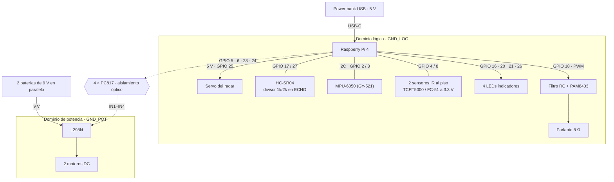
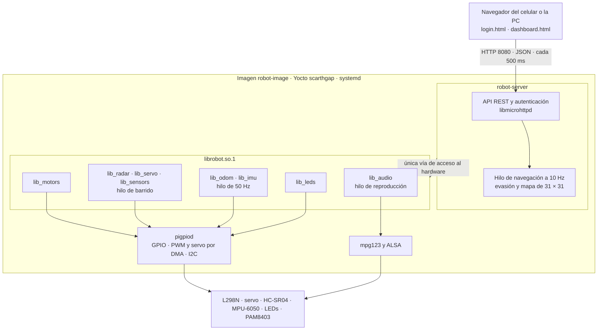

# Proyecto I — Robot Aspiradora Autónomo con Yocto

Curso **CE-1113 Sistemas Empotrados** — Instituto Tecnológico de Costa Rica
Robot aspiradora autónomo sobre **Raspberry Pi 4 Model B** con una imagen Linux mínima
construida con **Yocto Project (Poky, rama `scarthgap`)**.

El robot navega de forma autónoma evadiendo obstáculos con un radar ultrasónico (un
HC-SR04 sobre un servo de 180°) y un MPU-6050 que da su velocidad y el tiempo que falta
para chocar; reproduce MP3 por un amplificador PAM8403, y se controla remotamente desde
un servidor web embebido que muestra telemetría, el radar y el mapa de recorrido en
tiempo real. Todo el acceso al hardware pasa por una biblioteca dinámica propia
(`librobot.so`) compilada de forma cruzada para ARM.

> Estado del proyecto y desglose de tareas: [`TODO.md`](TODO.md) y los
> [issues del repositorio](https://github.com/Randall-BL/EmpotradosProyecto1/issues).

## Contenido

1. [Arquitectura del sistema](#1-arquitectura-del-sistema)
2. [Estructura del repositorio](#2-estructura-del-repositorio)
3. [Instalación](#3-instalación)
4. [Generación de la imagen Yocto](#4-generación-de-la-imagen-yocto)
5. [Compilación con la toolchain](#5-compilación-con-la-toolchain)
6. [Configuración y uso](#6-configuración-y-uso)
7. [API de la biblioteca dinámica](#7-api-de-la-biblioteca-dinámica)
8. [Paquetes agregados y su justificación](#8-paquetes-agregados-y-su-justificación)
9. [Evidencias de compilación cruzada](#9-evidencias-de-compilación-cruzada)
10. [Métricas de eficiencia de recursos](#10-métricas-de-eficiencia-de-recursos)
11. [Resultados](#11-resultados)
12. [Pruebas sin hardware](#12-pruebas-sin-hardware)
13. [Documentación](#13-documentación)
14. [Flujo de trabajo y licencia](#14-flujo-de-trabajo-y-licencia)

---

## 1. Arquitectura del sistema

### 1.1 Hardware

Dos fuentes independientes: un power bank USB alimenta la Raspberry Pi y todo lo que
trabaja a 5 V, y dos baterías alcalinas de 9 V en paralelo alimentan el puente H y los
motores. Las cuatro señales que cruzan del dominio lógico al de potencia —las entradas
del puente H— lo hacen por optoacopladores, y las dos tierras no se tocan en ningún
punto.



Los esquemas eléctricos dibujados están en
[`documentación/hardware-diagramas.pdf`](documentación/hardware-diagramas.pdf).

| Función | GPIO (BCM) | Nota |
|---|---|---|
| Motor derecho `IN1` / `IN2` (salida A) | 5 / 6 | Vía optoacoplador; `ENA` con jumper en el L298N |
| Motor izquierdo `IN3` / `IN4` (salida B) | 23 / 24 | Vía optoacoplador; `ENB` con jumper |
| Servo del radar | 25 | Señal directa; se alimenta de los 5 V de la Raspberry Pi |
| HC-SR04 `TRIG` / `ECHO` | 17 / 27 | `ECHO` con divisor 1 kΩ / 2 kΩ: el sensor entrega 5 V |
| MPU-6050 `SDA` / `SCL` | 2 / 3 | Módulo GY-521, alimentado de los 5 V de la Raspberry Pi |
| LED encendido / autónomo / manual / obstáculo | 16 / 20 / 21 / 26 | 5 mA cada uno |
| Sensores IR de desnivel izquierdo / derecho | 4 / 8 | Opcional. Módulos a 3.3 V, entradas con pull-down: sin módulo se lee "hay piso" |
| Audio PWM | 18 | Overlay `audremap`, filtro RC y PAM8403 |

El detalle —cálculos, listas de materiales y procedimientos de verificación— está en
[`docs/hardware-pinout.md`](docs/hardware-pinout.md),
[`docs/hardware-aislamiento.md`](docs/hardware-aislamiento.md),
[`docs/hardware-alimentacion.md`](docs/hardware-alimentacion.md),
[`docs/hardware-sensores.md`](docs/hardware-sensores.md) y
[`docs/hardware-chasis.md`](docs/hardware-chasis.md).

**Desviaciones acordadas con el profesor.** El diseño se aparta del enunciado en dos
puntos, ambos consultados con el profesor:

| Punto del enunciado | Lo que hace el robot | Motivo |
|---|---|---|
| Velocidad de los motores por PWM | Avanza, retrocede, gira y frena a velocidad fija, sin PWM | Los motores son lentos y de alto torque (60 rpm a 12 V) y trabajan a unos 9 V: con la tensión recortada por la PWM el robot no se mueve. Ver [`docs/hardware-aislamiento.md`](docs/hardware-aislamiento.md#velocidad-fija) |
| Al menos dos sensores de proximidad | Un HC-SR04 sobre un servo, que cubre el frente y los lados, y un MPU-6050 | El profesor lo consideró suficiente: lo que busca es que el robot tenga dos sensores. Ver [`docs/hardware-sensores.md`](docs/hardware-sensores.md) |

### 1.2 Software



| Componente | Qué hace |
|---|---|
| `robot-image` | Imagen sobre `core-image-minimal` con `systemd`, sin interfaz gráfica. La construye la capa propia `meta-robot`. |
| `librobot.so.1` | Biblioteca dinámica propia. Encapsula motores, radar, MPU-6050, odometría, LEDs y audio. Lanza tres hilos: odometría a 50 Hz, barrido del radar y reproducción de audio. |
| `robot-server` | Servidor HTTP en C sobre `libmicrohttpd`. Sirve el panel, expone la API y corre el hilo de navegación. Solo toca el hardware a través de `librobot`. |
| `pigpiod` | Demonio de GPIO. Genera PWM y pulsos de servo por DMA, mide el eco del HC-SR04 y da el bus I2C. Solo escucha en la interfaz local. |
| `robot-server.service` | Unidad `systemd` propia: arranque automático, `Requires=pigpiod.service` y `Restart=on-failure`. |

Cómo navega, cómo estima la velocidad y cómo construye el mapa:
[`docs/navegacion-radar.md`](docs/navegacion-radar.md).

---

## 2. Estructura del repositorio

```
.
├── lib/                    Biblioteca dinámica librobot.so (motores, radar, MPU-6050, LEDs, audio)
├── server/                 Servidor web embebido en C
│   ├── src/                  Código del servidor (API REST, autenticación, estado)
│   └── www/                  Interfaz web estática (login + dashboard)
├── audio/                  Recursos de audio
│   ├── notify_*.mp3          Sonidos de los 4 eventos del sistema
│   ├── canciones/            Playlist versionada, de dominio público
│   └── music/                Música propia (no se versiona, ver audio/README.md)
├── meta-robot/             Capa Yocto propia del proyecto
│   ├── conf/                 layer.conf, local.conf.sample y la máquina de QEMU
│   ├── recipes-image/        Receta de la imagen final (robot-image)
│   ├── recipes-multimedia/   Receta de librobot
│   ├── recipes-robot/        Receta del servidor web + unidad systemd
│   ├── recipes-support/      Receta de pigpio
│   ├── recipes-audio/        Configuración de ALSA
│   ├── recipes-connectivity/ Configuración de WiFi para arranque headless
│   ├── recipes-bsp/          Ajustes de config.txt y cmdline.txt
│   ├── recipes-kernel/       Fragmentos de configuración del kernel
│   └── wic/                  Tabla de particiones de la microSD
├── sim/                    Simulador de hardware: prueba librobot y el servidor sin la Raspberry
├── scripts/                Grabado de la microSD, medición de métricas, generación de la playlist
├── docs/                   Documentación técnica y evidencias
├── modelo-3d/              Carcasa impresa en 3D: modelo paramétrico (CadQuery), STL, STEP y vistas
├── documentación/          Documentos DI y AC, y diagramas de hardware (LaTeX y PDF)
├── CONTRIBUTING.md         Flujo de trabajo Git y convenciones de código
├── NOTICE.md               Atribución de software de terceros
└── TODO.md                 Desglose completo de requerimientos del enunciado
```

Los directorios de build de Yocto (`build/`, `tmp/`, `sstate-cache/`, `downloads/`) y los
artefactos de compilación (`*.o`, `*.so`, `CMakeFiles/`) están excluidos vía
[`.gitignore`](.gitignore): solo se versiona código fuente, recetas y documentación.

---

## 3. Instalación

### 3.1 Requisitos del host

Ubuntu 22.04 o 24.04, o Debian 12, de 64 bits.

| Recurso | Mínimo | Recomendado |
|---|---|---|
| Espacio en disco | 100 GB | 150 GB |
| RAM | 8 GB | 16 GB |
| Primer build | más de 5 horas | menos con más núcleos |

```bash
sudo apt update
sudo apt install -y gawk wget git diffstat unzip texinfo gcc build-essential \
    chrpath socat cpio python3 python3-pip python3-pexpect xz-utils \
    debianutils iputils-ping python3-git python3-jinja2 python3-subunit \
    zstd liblz4-tool file locales libacl1 bmap-tools
sudo locale-gen en_US.UTF-8
```

El build no puede hacerse sobre NTFS, exFAT ni un directorio de red. Con 8 GB de RAM o
menos hay que limitar el paralelismo: ver
[Hosts con poca memoria](docs/yocto-setup.md#hosts-con-poca-memoria).

### 3.2 Obtener el código

Poky, las capas y este repositorio, todos en la rama `scarthgap`:

```bash
mkdir -p ~/yocto && cd ~/yocto
git clone -b scarthgap https://git.yoctoproject.org/poky.git
cd poky
git clone -b scarthgap https://github.com/agherzan/meta-raspberrypi.git
git clone -b scarthgap https://github.com/openembedded/meta-openembedded.git
cd ..
git clone https://github.com/Randall-BL/EmpotradosProyecto1.git
```

---

## 4. Generación de la imagen Yocto

El procedimiento completo, con solución de problemas, está en
[`docs/yocto-setup.md`](docs/yocto-setup.md).

### 4.1 Agregar la capa `meta-robot/`

```bash
cd ~/yocto/poky
source oe-init-build-env            # crea build/ y deja la shell dentro

bitbake-layers add-layer ../meta-raspberrypi
bitbake-layers add-layer ../meta-openembedded/meta-oe
bitbake-layers add-layer ../meta-openembedded/meta-python
bitbake-layers add-layer ../meta-openembedded/meta-multimedia
bitbake-layers add-layer ../meta-openembedded/meta-networking
bitbake-layers add-layer ~/yocto/EmpotradosProyecto1/meta-robot

bitbake-layers show-layers          # deben aparecer las 8 capas
```

`meta-robot` se agrega **desde su ubicación dentro del repositorio clonado**. Las
recetas toman sus fuentes de `lib/`, `server/` y `audio/`, en la raíz del repositorio,
mediante `FILESEXTRAPATHS`: si se copia solo la carpeta de la capa, `do_fetch` falla.

### 4.2 Configurar el build

```bash
cat ~/yocto/EmpotradosProyecto1/meta-robot/conf/local.conf.sample >> conf/local.conf
```

Ese archivo lleva comentada la razón de cada variable. Lo esencial:

```
MACHINE ?= "raspberrypi4-64"
DISTRO_FEATURES:append = " systemd usrmerge wifi"
VIRTUAL-RUNTIME_init_manager = "systemd"
DISABLE_VC4GRAPHICS = "1"
ENABLE_I2C = "1"
RPI_KERNEL_DEVICETREE_OVERLAYS:append:rpi = " overlays/audremap.dtbo"
```

### 4.3 Credenciales de WiFi

El arranque es headless: el robot se conecta solo a la red. El archivo real está en
`.gitignore` y nunca se sube.

```bash
cd ~/yocto/EmpotradosProyecto1/meta-robot/recipes-connectivity/wifi-config/files
cp wpa_supplicant-wlan0.conf.sample wpa_supplicant-wlan0.conf
$EDITOR wpa_supplicant-wlan0.conf   # SSID y contraseña de la red
```

Si se omite, la receta usa la plantilla y `bitbake` avisa con un `WARNING`: la imagen se
construye igual, pero el robot no se conecta. Así un clon limpio produce la imagen sin
pasos manuales.

### 4.4 Construir

```bash
cd ~/yocto/poky/build
bitbake robot-image
```

Resultado:
`tmp/deploy/images/raspberrypi4-64/robot-image-raspberrypi4-64.rootfs.wic.bz2`.

### 4.5 Las recetas propias

| Receta | Qué integra |
|---|---|
| [`librobot_1.0.bb`](meta-robot/recipes-multimedia/librobot/librobot_1.0.bb) | La biblioteca dinámica de control |
| [`robot-server_1.0.bb`](meta-robot/recipes-robot/robot-server/robot-server_1.0.bb) | El servidor web, la interfaz, los audios y la unidad `systemd` |
| [`pigpio_1.0.bb`](meta-robot/recipes-support/pigpio/pigpio_1.0.bb) | `pigpio` desde su repositorio, con `SRCREV` fijo, y `pigpiod.service` |
| [`alsa-config_1.0.bb`](meta-robot/recipes-audio/alsa-config/alsa-config_1.0.bb) | `asound.conf` que dirige el audio a la salida PWM |
| [`wifi-config.bb`](meta-robot/recipes-connectivity/wifi-config/wifi-config.bb) | Credenciales de WiFi y configuración de red |
| [`robot-image.bb`](meta-robot/recipes-image/images/robot-image.bb) | La imagen final |

Cómo cumple `librobot_1.0.bb` lo que pide el enunciado:

```bitbake
# Copia las fuentes: viven en lib/, en la raíz del repositorio
FILESEXTRAPATHS:prepend := "${THISDIR}/../../../lib:${THISDIR}/../../..:"
SRC_URI = "file://lib_motors.c;subdir=lib file://lib_motors.h;subdir=lib ... \
           file://CMakeLists.txt;subdir=lib file://LICENSE;subdir=lib"
S = "${WORKDIR}/lib"

# Declara las dependencias de compilación y de ejecución
DEPENDS = "mpg123 alsa-lib"
DEPENDS:append:rpi = " pigpio"
RDEPENDS:${PN}:rpi = "pigpio-bin-pigpiod"

# Invoca CMake con la toolchain de Yocto
inherit cmake

# Instala los artefactos: el .so en la imagen, los headers en el paquete -dev
FILES:${PN}     = "${libdir}/librobot.so.1*"
FILES:${PN}-dev = "${libdir}/librobot.so ${includedir}/robot/*.h"
```

`robot-server_1.0.bb` agrega la unidad `systemd`, habilitada desde la receta y no a mano
en el target:

```bitbake
DEPENDS = "libmicrohttpd librobot"
inherit cmake systemd
SYSTEMD_SERVICE:${PN} = "robot-server.service"
SYSTEMD_AUTO_ENABLE = "enable"
```

El contenido de la capa está descrito en [`meta-robot/README.md`](meta-robot/README.md).

### 4.6 Grabar la microSD

```bash
./scripts/grabar-sd.sh              # busca la tarjeta, pide confirmación y verifica
```

O a mano:

```bash
cd tmp/deploy/images/raspberrypi4-64/
bzip2 -dk robot-image-raspberrypi4-64.rootfs.wic.bz2
lsblk                               # identificar el dispositivo antes de escribir
sudo bmaptool copy --nobmap robot-image-raspberrypi4-64.rootfs.wic /dev/sdX
```

La tarjeta queda con tres particiones, ninguna de más de 200 MB: `boot` (130 MiB),
`root` (180 MiB) y `canciones` (180 MiB).

---

## 5. Compilación con la toolchain

Nada se compila en la Raspberry Pi: la imagen no trae compilador. Además del build de
BitBake, el Toolchain-SDK permite compilar y probar un cambio sin reconstruir la imagen.
Detalle en [`docs/sdk.md`](docs/sdk.md).

### 5.1 Generar e instalar el SDK

```bash
cd ~/yocto/poky && source oe-init-build-env
bitbake -c populate_sdk robot-image

./tmp/deploy/sdk/poky-glibc-x86_64-robot-image-cortexa72-raspberrypi4-64-toolchain-*.sh \
    -y -d ~/robot-sdk
```

### 5.2 Compilar la biblioteca y el servidor

```bash
source ~/robot-sdk/environment-setup-cortexa72-poky-linux

cd ~/yocto/EmpotradosProyecto1/lib
mkdir -p build && cd build
cmake -DCMAKE_TOOLCHAIN_FILE=$OECORE_NATIVE_SYSROOT/usr/share/cmake/OEToolchainConfig.cmake ..
make -j$(nproc)

cd ~/yocto/EmpotradosProyecto1/server/src
mkdir -p build && cd build
cmake -DCMAKE_TOOLCHAIN_FILE=$OECORE_NATIVE_SYSROOT/usr/share/cmake/OEToolchainConfig.cmake ..
make -j$(nproc)
```

Cada terminal nueva necesita su `source`. Si `cmake` toma el compilador del host, casi
siempre faltó ese paso.

### 5.3 Verificar y probar en el target

```bash
file librobot.so.1.0.0
# ELF 64-bit LSB shared object, ARM aarch64, version 1 (SYSV), dynamically linked

scp librobot.so.1.0.0 root@<ip-del-robot>:/usr/lib/
scp robot-server      root@<ip-del-robot>:/usr/bin/
ssh root@<ip-del-robot> 'ldconfig && systemctl restart robot-server'
```

Sirve para iterar. Lo que se entrega es la imagen que produce `bitbake robot-image`.

---

## 6. Configuración y uso

### 6.1 Primer arranque

1. Insertar la microSD y encender el interruptor principal.
2. El robot arranca solo, sin pantalla ni teclado. Cuando el servidor está listo se
   enciende el **LED verde** y suena el aviso de inicio. Hay que dejarlo quieto en el
   piso durante ese primer segundo: el MPU-6050 se calibra al arrancar.
3. Buscar la IP que tomó el robot en la lista de clientes del router o del punto de
   acceso. También sirve la consola serie (115200 8N1) y
   `ip a`.

### 6.2 Panel de control

Abrir `http://<ip-del-robot>:8080` desde el celular o la PC, en la misma red.

| | |
|---|---|
| Usuario | `user1` |
| Contraseña | `password1` |

La sesión caduca a los 10 minutos de inactividad. El panel tiene tres pestañas:

| Pestaña | Qué ofrece |
|---|---|
| **Control** | Botones de modo autónomo y manual, ciclo de limpieza (meta por tiempo o por área, progreso y aviso de fin), controles direccionales, velocidad, estado de los cuatro LEDs y de los sensores de desnivel. Los motores van a velocidad fija, así que el control de velocidad no cambia la velocidad real |
| **Mapa** | La grilla de recorrido, el radar con las distancias a la izquierda, al frente y a la derecha, la velocidad que da el MPU-6050 y el tiempo antes de chocar, en tiempo real |
| **Audio** | Lista de canciones, reproducir, pausar, detener y volumen, y la playlist persistente: agregar con `+`, reordenar con ▲ ▼, quitar con ✕ y reproducirla completa |

### 6.3 Modos de operación

- **Autónomo.** El robot avanza y, al detectar un obstáculo, se detiene, retrocede, mira
  alrededor con el radar y gira hacia el lado más libre. Los controles direccionales
  quedan bloqueados.
- **Manual.** Los controles direccionales mandan los motores mientras se mantienen
  presionados. En la PC también funcionan las flechas y `W` `A` `S` `D`; la barra
  espaciadora detiene. Si aparece un obstáculo al frente, el robot frena solo.

**Desnivel (opcional).** Dos sensores infrarrojos en las esquinas delanteras miran al
piso. Si uno deja de ver piso —el borde de una grada—, el robot frena en cualquier modo.
En autónomo además retrocede y gira hacia el lado contrario (con los dos sensores, media
vuelta); en manual se niega a avanzar (`409`) hasta que se retroceda o se gire.

**Ciclo de limpieza (opcional).** Desde la pestaña Control se fija una meta: minutos en
modo autónomo o metros cuadrados recorridos (celdas nuevas del mapa × 0.09 m²). Al
cumplirla el robot se detiene, suena el aviso de fin de ciclo y el panel muestra
"Ciclo completado". Sigue quieto hasta que se pulse **Nuevo ciclo** o se vuelva a pedir
el modo autónomo.

### 6.4 Indicadores y sonidos

| LED | Color | Significado |
|---|---|---|
| Encendido | Verde | Sistema energizado y servidor activo |
| Autónomo | Azul | Modo autónomo en curso |
| Manual | Amarillo | Modo manual en curso |
| Obstáculo | Rojo | Obstáculo o desnivel detectado |

Hay un sonido para cada evento: inicio del sistema, inicio del modo autónomo, obstáculo
o desnivel detectado, cambio a modo manual y fin del ciclo de limpieza. El aviso pausa la
música y la reanuda al terminar.

### 6.5 Audio

Las canciones están en `/opt/robot/audio/canciones/`, en su propia partición. Una pista
elegida suelta se repite hasta que se detiene o se elige otra.

**Playlist persistente (opcional).** La lista ordenada que se arma en la pestaña Audio se
guarda en `/opt/robot/audio/canciones/playlist.txt`, un nombre de archivo por línea, en
la partición de la música: sobrevive a los reinicios. Se escribe en un temporal y se
renombra, así un corte de energía no la deja a medias. "Reproducir playlist" recorre la
lista en orden y vuelve a empezar al terminar. Sin archivo, la playlist son todas las
canciones.

Para agregar música:

- **Antes de construir:** copiar los MP3 a `audio/music/` (no se versiona).
- **Con el robot en marcha:** `scp cancion.mp3 root@<ip>:/opt/robot/audio/canciones/` y
  reiniciar el servicio.

### 6.6 Mapa de recorrido

Grilla de 31 × 31 celdas de 30 cm, con el robot empezando en el centro.

| Estado | Cuándo |
|---|---|
| Visitada | El centro del robot estuvo en la celda |
| Obstáculo | Un eco del radar cayó en la celda |
| Desconocida | Todo lo demás |

### 6.7 API HTTP

Todos los endpoints salvo el login exigen la cookie de sesión.

| Método y ruta | Cuerpo | Qué hace |
|---|---|---|
| `POST /api/login` | `{"username","password"}` | Inicia sesión |
| `POST /api/logout` | — | Cierra la sesión |
| `GET /api/status` | — | Modo, sensores, radar, movimiento, LEDs, audio y mapa |
| `POST /api/mode` | `{"mode":"autonomous"}` o `"manual"` | Cambia de modo |
| `POST /api/move` | `{"direction":"forward","speed":70}` | Mueve el robot, solo en modo manual. `direction`: `forward`, `backward`, `left`, `right`, `stop` |
| `GET /api/audio/list` | — | Lista de pistas |
| `POST /api/audio/control` | `{"action":"play","track_id":1}` | `play`, `pause`, `resume`, `stop`, `play_playlist` con `"index"`, o `seek` con `"position"` en segundos (la barra de progreso del panel) |
| `POST /api/audio/volume` | `{"volume":55}` | Volumen de 0 a 100 |
| `GET /api/audio/playlist` | — | Ids de la playlist en orden y la posición que suena |
| `POST /api/audio/playlist` | `{"ids":[3,1,9]}` | Reemplaza la playlist y la guarda en la SD |
| `POST /api/ciclo` | `{"tipo":"tiempo","minutos":5}`, `{"tipo":"area","m2":4}`, `{"tipo":"off"}` o `{"accion":"nuevo"}` | Configura la meta del ciclo de limpieza o empieza uno nuevo |

`GET /api/status` incluye además `ciclo` (tipo, meta, avance, `completo`) y `caida`
(sensores izquierdo y derecho, y eventos).

### 6.8 Cambiar la configuración

| Qué | Dónde | Después |
|---|---|---|
| Red WiFi | `wpa_supplicant-wlan0.conf` de la receta `wifi-config` | `bitbake -c cleansstate wifi-config && bitbake robot-image` |
| Usuario y contraseña | Tabla de usuarios en `server/src/auth.c`; el resumen sale de `echo -n 'clave' \| sha256sum` | Reconstruir la imagen |
| Umbrales de obstáculo y velocidades | Constantes de `server/src/main.c` y `lib/*.h` | Ver [`docs/odometria.md`](docs/odometria.md) |
| Pines | `#define` de la biblioteca | Ver [`docs/hardware-pinout.md`](docs/hardware-pinout.md) |

### 6.9 Diagnóstico

El robot no tiene pantalla: todo va al journal.

```bash
systemctl status robot-server
journalctl -u robot-server -f       # en vivo
journalctl -u pigpiod -b
```

Arranque automático y recuperación ante fallos:
[`docs/arranque-automatico.md`](docs/arranque-automatico.md).

---

## 7. API de la biblioteca dinámica

`librobot.so.1` es la única vía de acceso al hardware. Se enlaza con `-lrobot` y sus
headers están bajo `robot/`. Toda función que devuelve `int` usa `0` para éxito y `-1`
para error; las lecturas de distancia devuelven `-1.0` si no hubo eco.

La referencia completa, con tipos y ejemplos, está en
[`docs/api-librobot.md`](docs/api-librobot.md).

| Módulo | Funciones |
|---|---|
| **Fachada** `lib_robot.h` | `robot_init()` · `robot_shutdown()` · `robot_activo()` · `robot_distancia_frontal()` · `robot_distancia_izquierda()` · `robot_distancia_derecha()` |
| **Motores** `lib_motors.h` | `motores_set(izq, der)` · `motores_get()` · `motores_detener()` · `motores_avanzar(v)` · `motores_retroceder(v)` · `motores_girar_izquierda(v)` · `motores_girar_derecha(v)` · `motores_curva(v, giro)` |
| **Sensor** `lib_sensors.h` | `sensor_init()` · `sensor_leer_distancia()` |
| **Servo** `lib_servo.h` | `servo_init()` · `servo_mover(grados)` · `servo_angulo()` · `servo_liberar()` |
| **Radar** `lib_radar.h` | `radar_iniciar()` · `radar_detener()` · `radar_pausar()` · `radar_angulo_actual()` · `radar_lecturas()` · `radar_distancia(angulo)` · `radar_seq()` · `radar_barrido_completo()` · `radar_esperar_barrido()` · `radar_tiempo_choque()` · `radar_estado_choque()` · `radar_rayo()` |
| **Desnivel** `lib_caida.h` | `caida_init()` · `caida_leer()` |
| **MPU-6050** `lib_imu.h` | `imu_init()` · `imu_calibrar()` · `imu_leer()` · `imu_disponible()` · `imu_cerrar()` |
| **LEDs** `lib_leds.h` | `lib_leds_init()` · `lib_leds_set(led, estado)` · `lib_leds_get(led)` · `lib_leds_sync_from_state()` · `lib_leds_destroy()` |
| **Odometría** `lib_odom.h` | `odom_init()` · `odom_arrancar()` · `odom_parar()` · `odom_reset()` · `odom_update()` · `odom_get(x, y, rumbo)` · `odom_velocidad_cm_s()` · `odom_avance_cm()` · `odom_distancia_recorrida()` · `odom_get_velocidades()` · `odom_usa_imu()` |
| **Audio** `lib_audio.h` | `lib_audio_init(dir)` · `lib_audio_destroy()` · `lib_audio_scan()` · `lib_audio_get_tracks()` · `lib_audio_play(id)` · `lib_audio_pause()` · `lib_audio_resume()` · `lib_audio_stop()` · `lib_audio_seek(segundos)` · `lib_audio_set_volume(v)` · `lib_audio_get_volume()` · `lib_audio_get_status()` · `lib_audio_get_current_id()` · `lib_audio_get_position()` · `lib_audio_notify(evento)` · `lib_audio_playlist_get()` · `lib_audio_playlist_set()` · `lib_audio_play_playlist(pos)` · `lib_audio_playlist_pos()` |

Ejemplo mínimo:

```c
#include <robot/lib_robot.h>
#include <robot/lib_motors.h>
#include <robot/lib_radar.h>

int main(void) {
    if (robot_init() != 0) return 1;            /* con el robot quieto: calibra el MPU */
    while (trabajando) {
        double f   = robot_distancia_frontal();
        double ttc = radar_tiempo_choque();
        if ((f > 0 && f < 20.0) || (ttc >= 0 && ttc < 1.2))
            motores_detener();                  /* evadir */
        else
            motores_avanzar(200);
        usleep(100000);                         /* la odometría y el radar corren solos */
    }
    robot_shutdown();
    return 0;
}
```

---

## 8. Paquetes agregados y su justificación

La imagen parte de `core-image-minimal`, el punto de partida más pequeño de Poky. Todo lo
que se agrega está aquí; la discusión completa, con lo que se dejó fuera a propósito,
está en [`docs/paquetes.md`](docs/paquetes.md).

| Paquete | Justificación |
|---|---|
| `librobot` | Biblioteca dinámica de control. Obligatoria: única vía de acceso al hardware. |
| `robot-server` | Servidor web de control remoto. Obligatorio. |
| `wifi-config` | Credenciales y configuración de `wlan0`. Sin esto el arranque headless no llega a la red. |
| `alsa-config` | `asound.conf` que fuerza la salida PWM analógica. Sin esto ALSA elige HDMI. |
| `libmicrohttpd` | Servidor HTTP enlazable en C: un proceso menos que nginx o lighttpd, y pocos cientos de KB. |
| `mpg123` | Decodificador MP3, el más liviano con API en C. GStreamer traería decenas de MB. |
| `alsa-utils` | `amixer` para el control de volumen y `aplay` para diagnosticar la salida de audio. |
| `alsa-lib` | Runtime de ALSA; entra como dependencia de `librobot` y `mpg123`. |
| `pigpio`, `libpigpio`, `libpigpio_if2` | Acceso a GPIO con pulsos de servo de temporización estable, medición del eco en microsegundos e I2C. |
| `pigpio-bin-pigpiod` | El demonio al que se conecta `librobot`. |
| `wpa-supplicant` | Autenticación WPA2: la única forma de que un sistema headless se una solo a la red. |
| `wireless-regdb-static` | Base regulatoria; sin ella el kernel restringe canales y potencia. |
| `linux-firmware-rpidistro-bcm43455` | Firmware del chip WiFi de la Raspberry Pi 4. |
| `iw`, `rfkill` | Diagnóstico del enlace inalámbrico sin pantalla. Pocos KB. |
| `kernel-module-brcmfmac`, `-brcmfmac-wcc`, `-brcmutil` | Driver del chip WiFi Broadcom. |
| `kernel-module-snd`, `-snd-pcm`, `-snd-bcm2835` | Subsistema de sonido y driver de la salida de audio. |
| `kernel-module-i2c-bcm2835`, `-i2c-dev` | Bus I2C del MPU-6050. |
| `dhcpcd` | Solo en la imagen de QEMU, donde pide la IP. En la Raspberry la red la lleva `systemd-networkd`. |

Los módulos de kernel se listan uno por uno porque el paquete `kernel-modules` completo
sumaría decenas de MB de drivers que el robot no usa.

**Acceso remoto:** `ssh-server-openssh`, `openssh-sftp-server` y `debug-tweaks` dan
acceso al sistema sin pantalla y permiten recoger las métricas y diagnosticar el robot.

**Fuera a propósito:** entorno gráfico, driver VC4 y Mesa, GStreamer, Python 3,
`i2c-tools`, nginx y lighttpd, Bluetooth y el paquete `kernel-modules` completo.

---

## 9. Evidencias de compilación cruzada

Todas están en [`docs/evidencias/`](docs/evidencias/), generadas en un build real de
`bitbake robot-image`: host x86_64, target `raspberrypi4-64` (Cortex-A72).

### 9.1 Fragmento del log de Yocto

De `tmp/work/cortexa72-poky-linux/librobot/1.0/temp/log.do_compile`, con las rutas
abreviadas. El compilador es el cruzado, `aarch64-poky-linux-gcc`, invocado desde el
`recipe-sysroot-native`; el `gcc` del host no interviene.

```
[1/6] …/recipe-sysroot-native/usr/bin/aarch64-poky-linux/aarch64-poky-linux-gcc
      --sysroot=…/librobot/1.0/recipe-sysroot -Drobot_EXPORTS …
[5/6] : && …/aarch64-poky-linux-gcc --sysroot=…/recipe-sysroot -fPIC
      -mcpu=cortex-a72+crc -mbranch-protection=standard -fstack-protector-strong
      -O2 -D_FORTIFY_SOURCE=2 …
```

Los fragmentos sin abreviar:
[`librobot`](docs/evidencias/log.do_compile.librobot.txt),
[`robot-server`](docs/evidencias/log.do_compile.robot-server.txt) y
[`pigpio`](docs/evidencias/log.do_compile.pigpio.txt).

### 9.2 Los binarios son ARM y el servidor usa la biblioteca

De [`binarios-target.md`](docs/evidencias/binarios-target.md):

```
librobot.so.1.0.0: ELF 64-bit LSB shared object, ARM aarch64, version 1 (SYSV), dynamically linked, …
robot-server: ELF 64-bit LSB pie executable, ARM aarch64, version 1 (SYSV), dynamically linked,
              interpreter /usr/lib/ld-linux-aarch64.so.1, for GNU/Linux 5.15.0, stripped

  NEEDED               libmicrohttpd.so.12
  NEEDED               librobot.so.1
  NEEDED               libm.so.6
  NEEDED               libc.so.6
  NEEDED               ld-linux-aarch64.so.1
```

El servidor no enlaza `libpigpiod_if2`: el acceso a GPIO queda dentro de `librobot.so.1`.
Los binarios analizados tienen el mismo md5 que los que corren en la Raspberry Pi 4.

Un binario compilado con el SDK no corre en el host
([`sdk-prueba.md`](docs/evidencias/sdk-prueba.md)):

```
$ ./hola_sdk
bash: ./hola_sdk: no se puede ejecutar fichero binario: Formato de ejecutable incorrecto
```

### 9.3 Ejecución del binario ARM

El programa de prueba de la biblioteca, compilado con el SDK y ejecutado bajo
`qemu-aarch64`. Extracto de
[`ejecucion-cruzada-qemu.md`](docs/evidencias/ejecucion-cruzada-qemu.md), capturado
cuando la prueba tenía 18 comprobaciones; hoy son 47:

```
$ qemu-aarch64 -L $SDKTARGETSYSROOT ./prueba_librobot_arm

== Arranque ==
  [OK ] robot_init() abre la sesion con el hardware
  [OK ] robot_activo() lo confirma
…
== Motores: control diferencial ==
  [OK ] motores_set guarda la velocidad de cada motor
  [OK ] con el motor izquierdo mas rapido describe una curva a la derecha
  [OK ] motores_set satura en +-255
…
== Cierre ==
  [OK ] robot_shutdown cierra la sesion
  [OK ] los motores quedan detenidos

TODAS LAS PRUEBAS PASARON   (18/18)
```

La imagen completa arrancando en la máquina `qemuarm64-robot`, con `robot-server`
habilitado y activo desde la receta: [`docs/qemu.md`](docs/qemu.md).

### 9.4 Ejecución en la Raspberry Pi 4

Salida completa en [`ejecucion-target.md`](docs/evidencias/ejecucion-target.md),
capturada el 5 de octubre de 2026:

```
$ uname -a
Linux raspberrypi4-64 6.6.63-v8 #1 SMP PREEMPT Fri Dec  6 10:10:05 UTC 2024 aarch64 GNU/Linux

$ systemctl status robot-server
● robot-server.service - Servidor de control del robot aspiradora
     Loaded: loaded (/usr/lib/systemd/system/robot-server.service; enabled; preset: enabled)
     Active: active (running) since Mon 2026-10-05 22:30:23 UTC; 25min ago

$ ls -l /usr/lib/librobot.so*
lrwxrwxrwx    1 root     root            17 Mar  9  2018 /usr/lib/librobot.so.1 -> librobot.so.1.0.0
-rwxr-xr-x    1 root     root         67528 Mar  9  2018 /usr/lib/librobot.so.1.0.0

$ journalctl -u robot-server -b -o short-monotonic | grep -m1 "Servidor escuchando"
[   24.703636] raspberrypi4-64 robot-server[270]: [server] Servidor escuchando en puerto 8080

$ which gcc make cmake; echo $?
1
```

---

## 10. Métricas de eficiencia de recursos

Método, herramientas y justificación completos en [`docs/metricas.md`](docs/metricas.md).

| Métrica | Referencia | Resultado | Herramienta |
|---|---|---|---|
| Rootfs | ≤ 200 MB | **129 MB** | `du` sobre el rootfs de la imagen construida; `df -k /` en el target |
| Tiempo de arranque | ≤ 15 s | **19.2 s** | Relojes monotónicos de `systemd` y `journalctl -o short-monotonic` |
| RAM en operación normal | — | **97 MB** de 1845 MB; `robot-server` 5.2 MB | `MemTotal − MemAvailable` de `/proc/meminfo`; `VmRSS` por proceso |
| CPU en operación normal | — | **3.6 %** de 4 núcleos; `robot-server` 4.5 % de un núcleo | Diferencia de `/proc/stat` y `/proc/PID/stat` en 60 s |

Medido el 5 de octubre de 2026 sobre la imagen final, con el robot armado en modo
autónomo, música sonando y el panel consultando el estado cada 500 ms durante 60 s
(`./scripts/medir-metricas.sh <ip-del-robot>`).

**Rootfs.** Queda en el 65 % del presupuesto. Además, la tabla de particiones fija la
partición raíz en 180 MiB: si la imagen creciera por encima, el build fallaría.

**Arranque.** Excede la referencia en 4.2 s. `robot-server` espera a que la red esté
operativa, y la búsqueda del punto de acceso WiFi se lleva casi 7 s; desde que hay red
el servidor escucha en 1.5 s. Sin red el panel no es alcanzable, así que el servicio no
estaría operativo. Ya se redujo desde 130 s corrigiendo la configuración de red.

**RAM y CPU.** El sistema completo usa el 5 % de la RAM y el 3.6 % de la CPU; queda
margen de sobra en la Raspberry Pi 4.

---

## 11. Resultados

| Resultado | Evidencia |
|---|---|
| La prueba de la biblioteca pasa sus 49 comprobaciones, compilada para ARM bajo `qemu-aarch64` | [`sim/README.md`](sim/README.md), [`docs/navegacion-radar.md`](docs/navegacion-radar.md#6-evidencia-en-el-simulador) |
| Dos minutos en modo autónomo sobre el simulador: 18 evasiones y ningún choque | [`docs/navegacion-radar.md`](docs/navegacion-radar.md#6-evidencia-en-el-simulador) |
| El radar mide los siete ángulos a menos de 2 cm de la distancia real | [`docs/navegacion-radar.md`](docs/navegacion-radar.md#6-evidencia-en-el-simulador) |
| Odometría con MPU-6050: 5 % de error de posición y 0.4° de rumbo en un recorrido en L | [`docs/navegacion-radar.md`](docs/navegacion-radar.md#6-evidencia-en-el-simulador) |
| Desnivel: en el simulador, que tiene una grada que el HC-SR04 no ve, tres minutos en autónomo con una detección, evasión y ninguna caída | [`docs/opcionales.md`](docs/opcionales.md) |
| Ciclo de limpieza: con una meta de 12 s el robot se detuvo a los 12.5 s y sonó el aviso; pedir modo autónomo empezó otro | [`docs/opcionales.md`](docs/opcionales.md) |
| Playlist: se guardó en disco, sobrevivió a un reinicio del servidor y se reprodujo en orden y en bucle | [`docs/opcionales.md`](docs/opcionales.md) |
| El mapa crece en tiempo real: de 79 a 85 celdas visitadas en 6 s | [`docs/evidencias/servidor-web.md`](docs/evidencias/servidor-web.md) |
| La autenticación rechaza credenciales inválidas y protege los endpoints (HTTP 401) | [`docs/evidencias/servidor-web.md`](docs/evidencias/servidor-web.md) |
| Tras un `kill -9`, `systemd` reinicia el servidor solo: PID nuevo y `NRestarts=1` | [`docs/evidencias/systemd-reinicio.md`](docs/evidencias/systemd-reinicio.md) |
| La imagen completa arranca en QEMU y levanta el servicio sola | [`docs/qemu.md`](docs/qemu.md#resultado-de-la-primera-prueba-11-de-setiembre-de-2026) |
| El Toolchain-SDK se genera, se instala y compila para ARM | [`docs/evidencias/sdk-prueba.md`](docs/evidencias/sdk-prueba.md) |
| El arranque del servidor en la Raspberry Pi 4 bajó de 130 s a 17 s | Commit `5890dbb`, [`docs/metricas.md`](docs/metricas.md) |

### Modelo físico

Carcasa circular de 215 mm impresa en 3D, en dos piezas que cierran a presión. El diseño
completo está en [`docs/hardware-chasis.md`](docs/hardware-chasis.md) y los archivos, en
[`modelo-3d/`](modelo-3d/).

| Carcasa armada | Por dentro |
|---|---|
|  |  |

Las imágenes son vistas del modelo 3D.

> **PENDIENTE:** fotos del robot armado y un video de la demostración (navegación
> autónoma, modo manual, audio, LEDs y mapa), en `docs/evidencias/`.

---

## 12. Pruebas sin hardware

Cuatro formas de probar sin la Raspberry Pi:

| Qué | Cómo | Prueba |
|---|---|---|
| Biblioteca en la laptop | `cd sim && ./construir.sh && ./prueba_librobot` | `librobot` contra un robot virtual |
| Binario ARM | `sim/construir_arm.sh` | Que la compilación cruzada produce binarios que ejecutan |
| Servidor completo | `sim/construir_servidor.sh && sim/prueba_api.sh` | Cada endpoint, por HTTP |
| Imagen completa | `MACHINE=qemuarm64-robot runqemu robot-image nographic slirp` | Que la imagen arranca y levanta el servicio sola |

El simulador reemplaza a `pigpiod` por un robot virtual en una sala de 4 × 4 m, sin
tocar el código de `lib/`. Ver [`sim/README.md`](sim/README.md) y
[`docs/qemu.md`](docs/qemu.md).

---

## 13. Documentación

| Documento | Contenido |
|---|---|
| [`documentación/documento-diseno.pdf`](documentación/documento-diseno.pdf) | Documento de Diseño (DI1 a DI4) |
| [`documentación/aprendizaje-continuo.pdf`](documentación/aprendizaje-continuo.pdf) | Documento de Aprendizaje Continuo (AC1 a AC4) |
| [`documentación/hardware-diagramas.pdf`](documentación/hardware-diagramas.pdf) | Los diagramas de hardware dibujados |
| [`docs/yocto-setup.md`](docs/yocto-setup.md) | Preparación del host, capas, `local.conf`, build de la imagen y grabado de la microSD |
| [`docs/sdk.md`](docs/sdk.md) | Toolchain-SDK: generación, uso y verificación de la compilación cruzada |
| [`docs/qemu.md`](docs/qemu.md) | La imagen completa en QEMU |
| [`docs/paquetes.md`](docs/paquetes.md) | Justificación de cada paquete incluido en la imagen |
| [`docs/metricas.md`](docs/metricas.md) | Métricas de eficiencia: método, resultados y justificación |
| [`docs/api-librobot.md`](docs/api-librobot.md) | Referencia de la API pública de la biblioteca de control |
| [`docs/navegacion-radar.md`](docs/navegacion-radar.md) | Radar, velocidad con el MPU-6050, tiempo antes de chocar, evasión y mapa |
| [`docs/opcionales.md`](docs/opcionales.md) | Requerimientos opcionales: desnivel, fin de ciclo y playlist persistente |
| [`docs/odometria.md`](docs/odometria.md) | Calibración en campo: motores, servo, MPU-6050, umbrales y odometría |
| [`docs/arranque-automatico.md`](docs/arranque-automatico.md) | Unidades systemd, arranque automático y recuperación ante fallos |
| [`docs/hardware-pinout.md`](docs/hardware-pinout.md) | Mapa de pines GPIO: referencia única del cableado |
| [`docs/hardware-aislamiento.md`](docs/hardware-aislamiento.md) | Etapa de potencia, optoacopladores y separación de tierras |
| [`docs/hardware-alimentacion.md`](docs/hardware-alimentacion.md) | Power bank para la lógica y baterías de 9 V para los motores |
| [`docs/hardware-sensores.md`](docs/hardware-sensores.md) | Radar, MPU-6050, LEDs y audio con PAM8403 |
| [`docs/hardware-chasis.md`](docs/hardware-chasis.md) | Carcasa impresa en 3D, tracción, succión y distribución interna |
| [`modelo-3d/`](modelo-3d/) | Modelo paramétrico de la carcasa, piezas para imprimir y vistas |
| [`docs/evidencias/`](docs/evidencias/) | Logs de compilación cruzada y evidencias de ejecución |
| [`meta-robot/README.md`](meta-robot/README.md) | Contenido de la capa Yocto y cómo agregarla al build |

---

## 14. Flujo de trabajo y licencia

El repositorio usa ramas `main` y `develop` con ramas de trabajo por funcionalidad,
Conventional Commits, Pull Requests e issues agrupados en hitos. Las convenciones están
en [`CONTRIBUTING.md`](CONTRIBUTING.md).

El proyecto se distribuye bajo licencia MIT: ver [`LICENSE`](LICENSE). Parte de la capa
y del código deriva de un proyecto de referencia con la misma licencia; la atribución y
las licencias del software de terceros están en [`NOTICE.md`](NOTICE.md).
