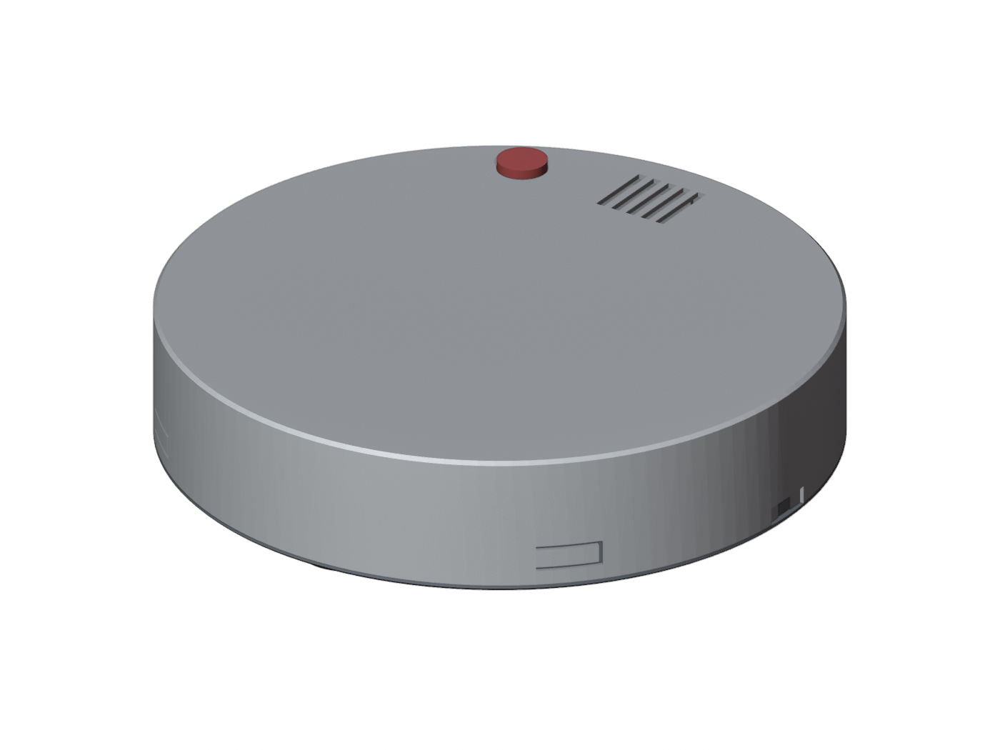
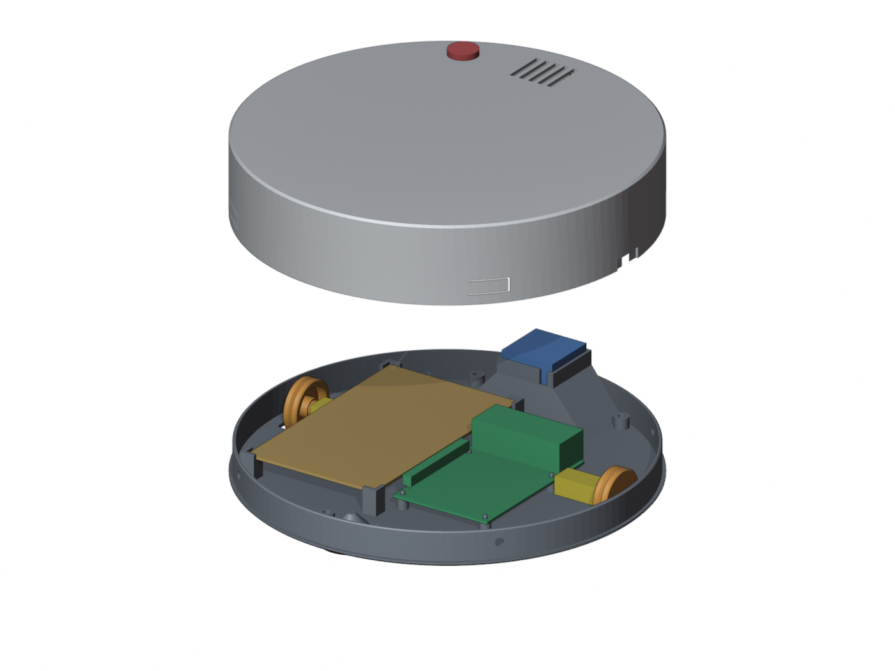
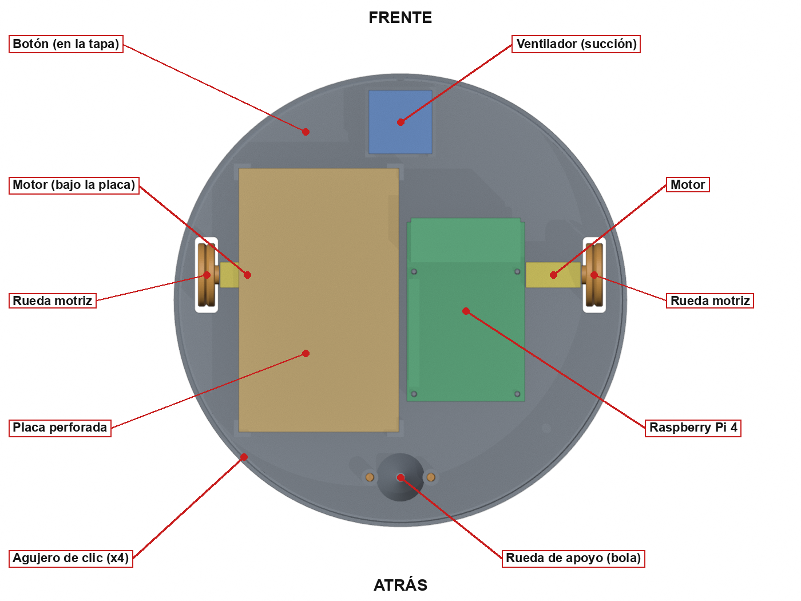
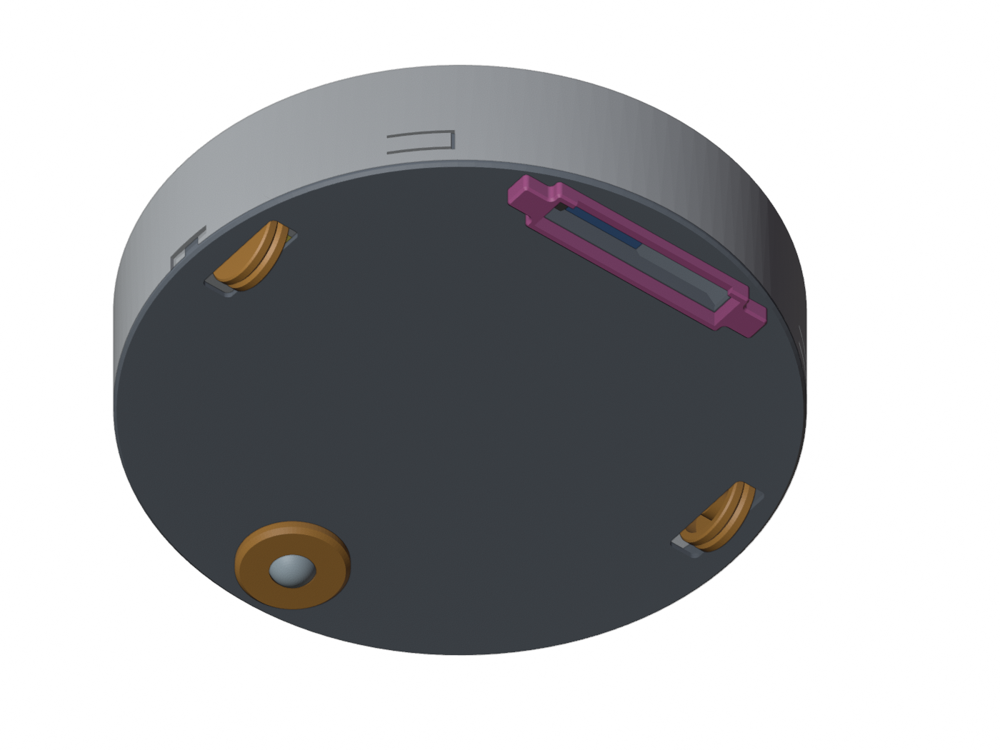

# Chasis y modelo físico

El modelo físico tiene rubro propio: se evalúa **funcionalidad y estética**. El chasis
es una carcasa circular impresa en 3D, de dos piezas que cierran a presión, sin
tornillos. Los archivos del diseño —modelo paramétrico, piezas para imprimir y vistas—
están en [`../modelo-3d/`](../modelo-3d/).

---

## Forma: circular

| | **Circular** | Rectangular |
|---|---|---|
| Girar en un espacio cerrado | Gira sobre su eje sin tocar nada | Las esquinas chocan al girar |
| Salir de un rincón | Rota y sale | Se puede trabar |
| Aprovechamiento del área interna | Menor | Mayor |
| Referencia visual | Es lo que la gente espera de una aspiradora | Parece un prototipo |

**Se eligió circular.** Con tracción diferencial y carcasa circular, el robot gira sobre
su propio centro sin barrer área adicional, así que cualquier rincón del que pueda
entrar es un rincón del que puede salir. Y es la silueta que se asocia a una aspiradora
robot.

---

## Dimensiones

| Parámetro | Valor | Motivo |
|---|---|---|
| Diámetro exterior | **215 mm** | El máximo que entra en la cama de la impresora (249 × 219 mm) |
| Altura de la carcasa | **45 mm** | Con las ruedas, el robot mide 53 mm desde el suelo |
| Separación al piso | **8 mm** | La que deja una rueda de 30 mm con el motor apoyado en el piso de la carcasa |
| Pieza inferior | 18 mm de alto | Piso de 2.0 mm y pared de 1.6 mm |
| Pieza superior | 43 mm de alto | Tapa y pared de 1.6 mm |
| Masa impresa | unos 265 g | Inferior 124 g, superior 125 g, dos ruedas 9 g, aro 4 g, boquilla 4 g |

Los espesores son bajos a propósito: la carcasa es lo que más pesa de lo impreso, y los
motores son lentos.

---

## Piezas

| Pieza | Archivo | Cantidad |
|---|---|---|
| Carcasa inferior, versión de succión | `carcasa_inferior_succion.stl` | 1 |
| Boquilla de succión | `boquilla_succion.stl` | 1 |
| Carcasa superior | `carcasa_superior.stl` | 1 |
| Rueda motriz de 30 mm | `rueda_motriz_x2.stl` | 2 |
| Aro de la rueda de apoyo | `rueda_apoyo_aro.stl` | 1 |
| Bola de la rueda de apoyo, 16 mm | `rueda_apoyo_bola_16mm.stl` o una canica | 1 |

Todas vienen en la orientación en que se imprimen y no necesitan soportes. Los `.step`
son las mismas piezas para editar en un programa CAD, y `carcasa_roomba.py` es el modelo
paramétrico en CadQuery: cambiando los valores del inicio se regenera todo.

### Cómo cierra

La pieza superior baja por fuera de la pared de la inferior y se apoya en el borde del
piso. Tiene **cuatro pestañas flexibles** con un botón por dentro, que hacen clic en
cuatro agujeros de la pared inferior. Una guía al frente hace que la tapa entre en una
sola posición. Para abrir, se sujeta el borde del piso por las dos muescas laterales y
se jala la tapa: la Raspberry Pi y la placa quedan a la vista sin desatornillar nada.

---

## Distribución interna

| Componente | Dónde va |
|---|---|
| Motores | Sobre el piso, junto a la ranura de cada rueda, con el eje hacia afuera. No llevan soporte. El izquierdo queda debajo de la placa perforada |
| Ruedas motrices | A presión en el eje en D del motor, con una liga o un O-ring en el canal para el agarre |
| Rueda de apoyo | Atrás: una bola de 16 mm en un asiento cónico del piso, sujeta por un aro que entra a presión |
| Placa perforada | Lado izquierdo, a lo largo, apoyada en cuatro esquinas a 11 mm del piso |
| Raspberry Pi 4 | Lado derecho, a lo largo, sobre cuatro espigas. SD hacia atrás, USB y Ethernet hacia el frente, GPIO hacia la placa |
| Ventilador de succión | Al frente, sobre la campana, en un marco a presión, soplando hacia arriba |
| Rejilla de salida de aire | En la tapa, encima del ventilador |
| Botón | Agujero de 16.2 mm en la tapa, al frente a la izquierda |

El radar (servo y HC-SR04), el L298N, el power bank, las dos baterías de 9 V, el
MPU-6050, el amplificador y el parlante también van **dentro de la carcasa**. El diseño
impreso no les reserva un soporte propio: se acomodaron en el espacio libre. El peso
conviene dejarlo atrás, entre las ruedas motrices y la bola; adelante hace cabecear al
robot.

---

## Tracción

**Dos motores DC con reductora y una bola de apoyo atrás.** El eje de tracción va 12 mm
por delante del centro.

| Componente | Especificación |
|---|---|
| Motores | Micro motorreductor AD12672: 30 rpm a 6 V y 60 rpm a 12 V; par a rotor bloqueado de 110 oz-in a 6 V y 200 oz-in a 12 V |
| Ruedas | Impresas, 30 mm de diámetro y 8 mm de ancho, con cubo para eje en D de 3 mm y canal en V para una liga |
| Rueda de apoyo | Bola de 16 mm (canica) en asiento cónico |

### Por qué la rueda es de 30 mm

El motor mide 10 mm de alto. Apoyado sobre el piso de la carcasa, su eje queda a 7 mm de
la cara de abajo. Una rueda de 15 mm dejaría la carcasa a 0.5 mm del suelo y rozaría;
con 30 mm queda a 8 mm.

### Fuerza y velocidad

| | A 6 V | A 12 V |
|---|---|---|
| Fuerza que puede dar cada rueda | 52 N | 94 N |
| Velocidad del robot | 4.7 cm/s | 9.4 cm/s |

Mover el robot pide unos 2 N en total: el motor trabaja a un 2 % de su par máximo, así
que **sobra fuerza y falta velocidad**. Con las baterías de 9 V y los 2 V que cae el
L298N, a los motores les llegan cerca de 7 V, lo que da entre 5 y 6 cm/s. Es la razón de
fondo de que no se use PWM: recortar la tensión a un motor que ya es así de lento lo
deja sin moverse (ver [`hardware-aislamiento.md`](hardware-aislamiento.md#velocidad-fija)).

Lo que limita es el agarre: la rueda de plástico lisa patina, y por eso lleva el canal
para la liga.

### Odometría

Los motores no traen encoder. La odometría combina dos fuentes: el **MPU-6050**, cuyo
giroscopio da el rumbo y cuyo acelerómetro, integrado, da la velocidad; y el **modelo de
los motores** —su velocidad a fondo, medida en la calibración—, que corrige la deriva
del acelerómetro. El detalle está en [`navegacion-radar.md`](navegacion-radar.md).

> La velocidad a fondo del modelo es `ODOM_VEL_MAX_CM_S` en `lib/lib_odom.h`. Su valor
> por defecto es de 30 cm/s, el del simulador: en el robot hay que medirla y cambiarla,
> porque la real es varias veces menor (ver [`odometria.md`](odometria.md)).

---

## Succión

| Elemento | Descripción |
|---|---|
| Boca de succión | Ranura de 70 × 12 mm en el piso, al frente |
| Campana | De 72 × 29 mm sobre la boca; se va cerrando hasta el ventilador, 22 mm más arriba. Detrás de la boca hay un reborde de 4 mm donde se asienta el polvo pesado |
| Ventilador | AD32862, de 30 mm, 5 V y 0.16 A, encima de la campana |
| Boquilla | Pieza aparte que entra a presión por debajo. Baja la entrada de aire de 8 mm a 2 mm del suelo |

Límite real: el ventilador es un *cooler* de 30 mm. Con esta entrada de aire levanta
polvo liviano y pelusa, no migas ni arena; para aspirar más haría falta un ventilador
tipo turbina.

---

## Material

| Pieza | Material recomendado | Por qué |
|---|---|---|
| Carcasa superior | PETG | Las cuatro pestañas se doblan cada vez que se abre; el PLA se quiebra antes |
| Carcasa inferior | PETG, o PLA | El PETG aguanta mejor el calor de la Raspberry Pi |
| Ruedas motrices | PETG | El cubo entra a presión en el eje y el PLA puede rajarse |
| Aro de la bola | PETG | Sus dos pines partidos tienen que flexionar |
| Bola | Canica de vidrio | Rueda más suave que una impresa |

---

## Del primer diseño al final

El chasis se rehízo una vez. Con el cambio de diseño hubo que cambiar también los
motores, y los dos motores y el ventilador comprados para la primera versión quedaron
sin uso. Antes de diseñar se desarmó una aspiradora robot comercial para estudiar cómo
resuelve la tracción y la succión.

---

## Cableado

- Los **cables de motor** van trenzados entre sí y separados de los de señal.
- **Conectores desconectables** (Dupont) en motores y sensores: permiten desarmar sin
  desoldar, y la Raspberry Pi se devuelve al curso sin soldaduras.
- Ningún cable cerca de las ranuras de las ruedas.

---

## Estado

- [x] Forma decidida (circular) y justificada contra la alternativa
- [x] Modelo paramétrico en CadQuery, con las piezas en STL y STEP
- [x] Comprobación de fuerza y velocidad contra el motor
- [x] Carcasa impresa y robot armado
- [ ] Fotos del robot armado, en `docs/evidencias/`
